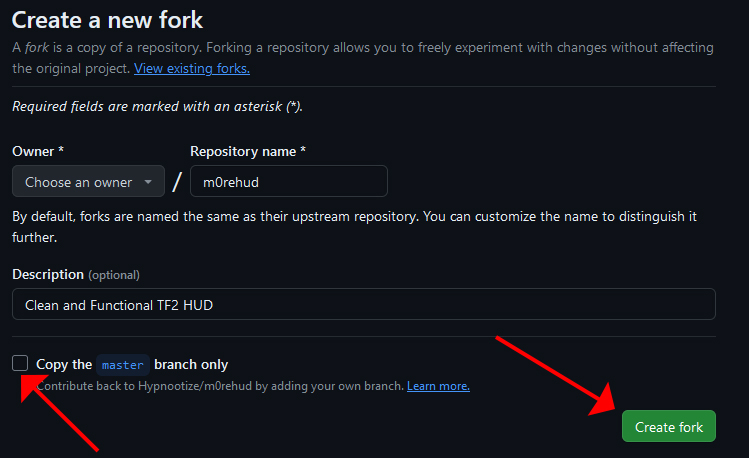
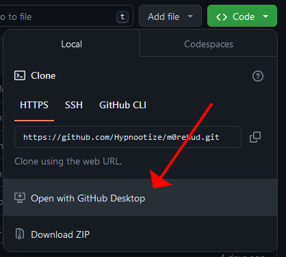
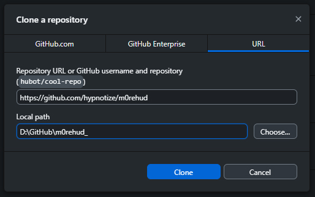
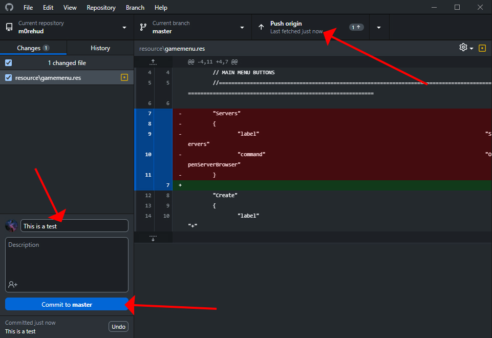
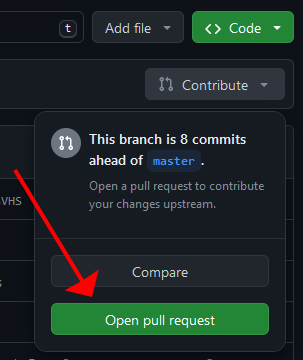
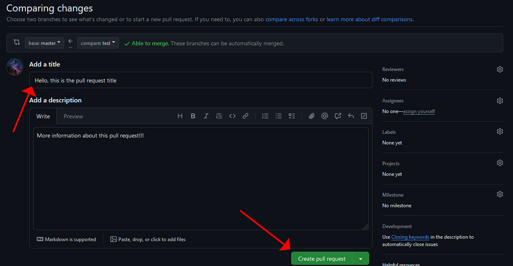

# CONTRIBUTING TO A HUD ON GITHUB

You can directly contribute to a GitHub repository by creating a new pull request. This will obviously require a GitHub account and, to make the process as easy as possible, a tool like [GitHub Desktop](https://desktop.github.com).

To start, fork the HUD repository you are interested in:

If the repository features multiple branches you are looking to make changes to then make sure to uncheck the `Copy the main branch only` option

Then go ahead and click `FORK`

This will create your personal copy of the repository ready for you to edit and commit your changes to. Depending on how many and substantial your changes are going to be, it might be better downloading the repository and editing the files directly with your preferred text editor, this is where GitHub Desktop comes in. In the GitHub page of your own repository fork click the green `<> CODE` button and then `Open with GitHub Desktop`

This will bring up a clone settings window in GitHub Desktop where you can chose where to clone your repository, select a valid local path and then hit the clone button

You should now have a local copy of your repository ready to be edited.

Once you made all the wanted changes it's time to upload them. Open GitHub Desktop and on the left you should see the full list of the changes, make sure to give a name to your changes and then click the commit button.

When all the changes have been commited you can then upload them by using the `^ Push Origin` button in the top right:

Now that all the changes are uploaded it's time to create a new pull request to the original repository. From your GitHub page click on the `Contribute` button and then select the green `Open Pull Request` button

This will bring up a new window where you can add a title and a description to your pull request:

Add all the informations about your pull request and once you are satisfied with it simply click the green `Create Pull Request` Button
