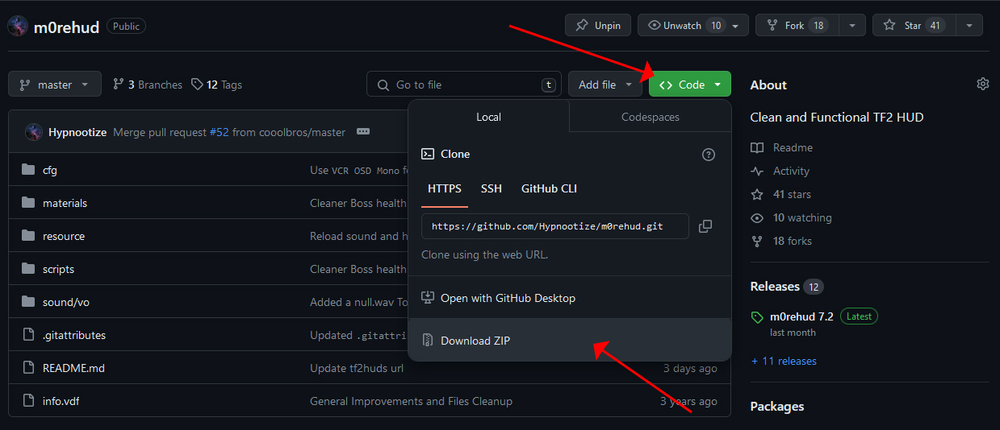
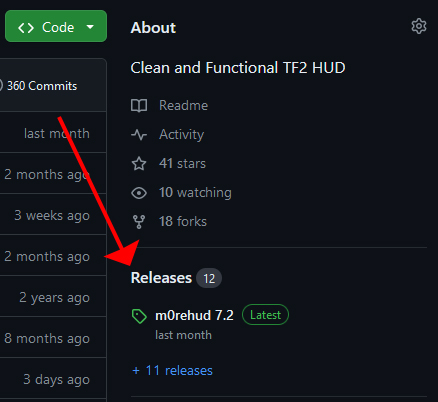
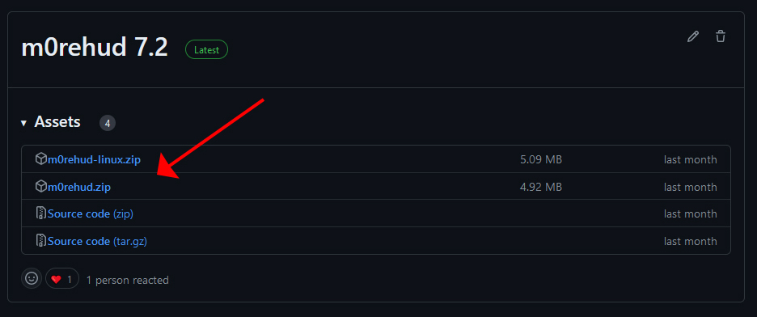

# DOWNLOADING A TF2 HUD FROM GITHUB

First open the GitHub page of the HUD you are trying to download.

From here, in order to download the last version of the HUD, simply click on the green `<> CODE` button and then select `DOWNLOAD ZIP`

This will download the `.zip` archive containing the HUD folder. From here you can follow the [installation guide](../installation/windows_install.md) on how to install a TF2 HUD.

## DOWNLOADING FROM RELEASES

Certain HUDs GitHub pages might also feature releases. Some HUD developers go through a lot of iterations and changes with their HUDs so downloading the latest version might now always be the best choice of you, instead you might want to download the HUD from a release. Releases usually feature a more stable and polished version of the HUD.

In order to browse the releases simply click on the `Releases` button in the right side:

You can then click on the release you are intersted to. As downloads you will often find either `Source Code (zip)` or a `.zip` archive named after the HUD, in this example `m0rehud.zip`

