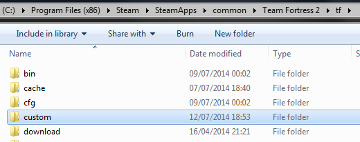
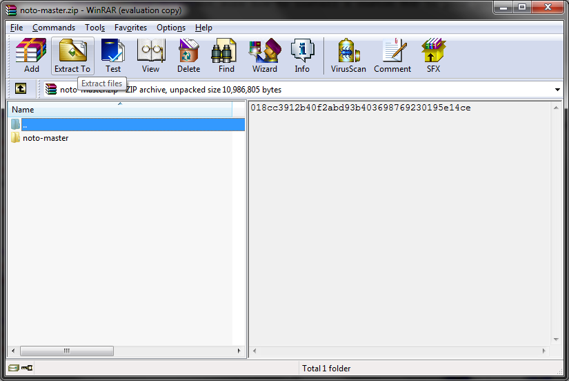

# TF2 HUD INSTALLATION FOR WINDOWS

Before doing anything else, locate your Team Fortress 2 folder, to do so open Steam and right click on `Team Fortress 2 > Properties > Installed Files > Browse`. You should now be inside the `Team Fortress 2` root folder, from here open the `tf` folder and if missing create a new `custom` folder, if it's already there simply open it!



The next thing to do is to download the HUD you wish to use, I'll use NotoHUD for this example. Usually, they will come downloaded in a compressed `.zip`, `.rar`, `.7z` or another compression file.


Extract the contents of the compressed archive using a software like 7zip, WinRAR or other.



With the archive now extracted you should have the decompressed HUD folder. Inside, depending on how the HUD has been packaged, you will always find 2 folders named `Resource` and `Scripts` and the `info.vdf` file. Some HUDs may come with other folders, such as `Materials` `Sound` and `cfg`.

For example the folder structure of NotoHUD is:
```
- NotoHUD
  - Materials
  - Resource
  - Scripts
  - info.vdf
```

Now, copy the main HUD folder, in this example it will be the NotoHUD folder, and paste it into the `tf/custom` folder. If done correctly, your directory should look similar to this:


Make sure not to paste the HUD folder into the tf/ directory, like this


Or else the HUD will not load
In the same vein, make sure you don't copy too many folders into the `tf/custom` directory, like this


As again, the HUD will not load.
Now, load up your game. If done correctly, you'll be greeted by a nice, new HUD!

#
*Guide by HUDS.TF, omnibombulator. Reviewed by Hypnotize.*
#
[LINUX INSTALLATION](../installation/linux_install.md)

[MAC OS INSTALLATION](../installation/mac_install.md)
